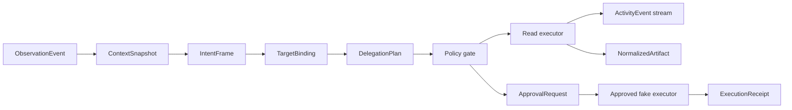

# Backend Control Plane

The Adaptive Surface backend now has a Rust-owned control-plane foundation under `src-tauri/src/control_plane/`.

The control plane is intentionally not a replacement work engine. It observes a bounded context, frames intent, resolves declared capabilities, supervises delegated operations, and records provenance. Native apps, connectors, and external executors remain the systems that perform and store the authoritative work.

## Module Boundaries

- `contracts.rs` defines the serializable boundary: observations, context snapshots, intent frames, capabilities, target bindings, delegation plans, activity events, approval requests, interventions, artifacts, receipts, and recovery snapshots.
- `engine.rs` implements the deterministic local slice, policy gates, fake executors, activity replay and deduplication, transition validation, recovery reporting, and JSON recovery snapshot helpers.
- `lib.rs` registers `run_control_plane_demo` as the narrow Tauri command exposed to the desktop runtime.
- `src/lib/control-plane-api.ts` and `src/types/control-plane.ts` expose a typed frontend IPC wrapper without changing app visuals.

## Runtime Principle

Adaptive Surface owns:

- the user objective
- minimal context references
- intent hypotheses
- capability binding
- delegation lifecycle
- approval and intervention semantics
- live activity and provenance

External systems own:

- messages
- documents
- files
- calendars
- designs
- final storage
- native undo/history
- domain computation

The code enforces this by requiring every executable action to bind to a `CapabilityDescriptor`. The deterministic demo cannot directly invoke Mail, files, shell commands, or OS automation. The proposed external mail operation creates an `ApprovalRequest` and remains unexecuted until the exact plan revision is approved.

## Current Slice

The implemented slice supports:

1. A synthetic or IPC-provided observation.
2. A bounded focus-context snapshot for the active window and selected text.
3. A deterministic intent frame with workflow family, lifecycle stage, commitment tier, risk, bindings, confidence, and alternatives.
4. Capability resolution for `context.read` and, when the objective implies proposed external communication, `mail.send`.
5. A delegation plan with read operation dispatch and a proposed mutating operation.
6. Policy gating that puts the external operation into `awaiting_approval`.
7. Activity events with per-operation sequence numbers and provider-event deduplication.
8. A normalized artifact derived from the bounded focus context.
9. Approve, reject, and cancel handling.
10. Recovery reporting for stale context, expired approvals, and in-flight non-idempotent operations.

## Non-Scope

- No frontend layout, color, typography, or visual behavior changed.
- No native permission, Tauri capability, signing, bundle identifier, shell permission, or app integration access was broadened.
- No live Mail, Calendar, file, browser, or OS mutation is performed by the demo slice.
- No workflow atlas ingestion was implemented because the atlas file is not present in this repository.
