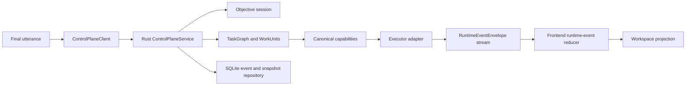

# Backend Control Plane

Adaptive Surface now has a live Rust-owned control-plane service for finalized
objective increments. The service is registered as Tauri-managed state and owns
session IDs, objective IDs, task graphs, work-unit lifecycle, ordered runtime
events, artifact envelopes, pending approvals, and local persistence for the
migrated slice.

The control plane is not a replacement for Mail, Calendar, files, or external
apps. Those systems remain authoritative for their own data. Adaptive Surface
owns the local supervision layer, event history, provenance, and UI projection.

## Module Boundaries

- `contracts.rs` defines the serializable boundary: observations, context
  snapshots, intent frames, capabilities, target bindings, delegation plans,
  task graphs, work units, runtime events, artifact envelopes, approval requests,
  interventions, receipts, recovery snapshots, and live session snapshots.
- `engine.rs` keeps the deterministic demo and contract-state tests as a fixture
  for lower-level invariants.
- `repository.rs` provides the in-memory test repository and SQLite app
  repository for ordered events and session snapshots.
- `service.rs` implements `ControlPlaneService`, canonical migrated
  capabilities, inbox-triage task graph execution, event sequencing, persistence,
  cancellation, approval/rejection commands, and replay reconstruction.
- `lib.rs` registers live commands:
  `submit_final_utterance`, `cancel_operation`, `approve_operation`,
  `reject_operation`, `get_session_snapshot`, `list_pending_approvals`, and
  `list_control_plane_capabilities`.
- `src/control-plane/runtime-event-reducer.ts` is the single frontend projection
  path from runtime events to workspace patches.

## Runtime Principle

Partial voice remains local and speculative. Finalized inbox-triage utterances
enter the Rust service first in the Tauri app. Non-migrated finalized utterances
stay on the explicit TypeScript compatibility path until they have typed Rust
task graphs, so the app does not persist unsupported raw commands in the
control-plane log.

## Migrated Slice

The first migrated vertical slice is read-only inbox triage:

1. `submit_final_utterance` accepts a finalized inbox-triage utterance.
2. Rust creates a `TaskGraph` with `mail.search`, `triage.classify`, and
   `artifact.create` work units.
3. The Mail work unit loads Apple Mail metadata only.
4. The artifact work unit creates an in-app Markdown document envelope.
5. Ordered runtime events are returned and also emitted on
   `control-plane://runtime-event`.
6. The frontend reducer projects the artifact into the existing `document`
   surface.

The slice does not read full message bodies, write files, send mail, archive,
delete, label, mark, or mutate the mailbox.

## State Ownership

- Rust owns finalized objective/session state for the migrated slice.
- Rust owns plan revisions, task graph state, work-unit lifecycle, approval
  records, event ordering, artifacts, and replay snapshots.
- Zustand owns rendering projection and local interaction state.
- TypeScript may own partial/interim transcript state, speculative intent labels,
  browser-only mock transport, and compatibility fallback for non-migrated
  routes.

## Event Protocol

Every `RuntimeEventEnvelope` includes:

- `protocolVersion`
- `eventId`
- monotonic `sequence`
- `sessionId`
- `objectiveId`
- `planRevision`
- optional `graphId` and `workUnitId`
- `runId`
- timestamp
- discriminated payload

The frontend reducer rejects unsupported protocol versions, duplicate event IDs,
and stale sequence numbers.

## Capability Authority

Rust is canonical for migrated semantic capabilities:

- `mail.search`
- `triage.classify`
- `artifact.create`

Each descriptor includes provider binding, input/output contracts, availability,
risk class, approval requirement, timeout, cancellation support, idempotency, and
side-effect class. The migrated descriptors are tested to stay read-only or
local-reversible.

## Persistence And Replay

The app repository is SQLite-backed and stores:

- ordered runtime events
- latest session snapshots
- task graphs
- artifact envelopes
- approval records included in snapshots

The repository ignores corrupt or unknown-future event payloads during replay.
This keeps recovery conservative without treating stale or unknown data as live
truth.

## Cancellation And Approval Binding

`cancel_operation`, `approve_operation`, and `reject_operation` use typed
`OperationCommand` inputs with session ID, work-unit ID, plan revision, and
optional approval ID. Stale plan revisions are rejected. Mutating operations for
future slices must use approval records bound to the exact plan revision before
dispatch.

## Extension Point

Future worker runtimes can be added behind semantic capabilities and executor
adapters. They should emit runtime events and artifact envelopes, not patch React
state directly and not bypass Rust policy evaluation.
