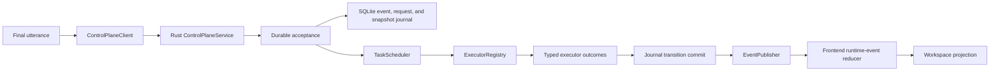

# Backend Control Plane

Adaptive Surface now has a live Rust-owned control-plane service for finalized
objective increments. The service is registered as Tauri-managed state and owns
session IDs, objective IDs, task graphs, work-unit lifecycle, ordered runtime
events, artifact envelopes, pending approvals, and local persistence for the
migrated slice.

The control plane is not a replacement for Mail, Calendar, files, or external
apps. Those systems remain authoritative for their own data. Adaptive Surface
owns the local supervision layer, event history, provenance, and UI projection.

## Module Boundaries

- `contracts.rs` defines the serializable boundary: observations, context
  snapshots, intent frames, capabilities, target bindings, delegation plans,
  task graphs, work units, runtime events, artifact envelopes, approval requests,
  interventions, receipts, recovery snapshots, and live session snapshots.
- `engine.rs` keeps the deterministic demo and contract-state tests as a fixture
  for lower-level invariants.
- `policy.rs` is the deterministic Rust policy evaluator. It decides `Allow`,
  `RequireApproval`, or `Deny` before dispatch and fails closed on unknown
  capabilities, stale consequential context, authority mismatches, destructive
  effects, operation-count overflow, and risk or side-effect mismatches.
- `data_guard.rs` classifies egress by sensitivity and destination and redacts
  secret-shaped values before diagnostics or approval previews are persisted.
- `authorization.rs` creates the module-private `AuthorizedOperation` wrapper.
  Executors receive this wrapper rather than raw model-facing or frontend-facing
  work units.
- `repository.rs` provides the in-memory test repository and SQLite app
  repository for ordered events, request ledger records, catch-up queries, and
  session snapshots.
- `journal.rs` is the short-lock persistence boundary. It allocates per-session
  event sequence numbers, updates snapshots, commits transitions, and publishes
  only after durable storage succeeds.
- `executors.rs` defines typed capability executors. Executors return typed
  outcomes and never patch React or Zustand directly.
- `scheduler.rs` validates task graphs, finds dependency-ready work, dispatches
  with bounded concurrency, enforces deadlines, and suppresses late results
  after cancellation or timeout.
- `publisher.rs` owns best-effort Tauri event delivery on
  `control-plane://runtime-event`.
- `service.rs` implements the lightweight `ControlPlaneService` facade for
  durable request acceptance, command validation, approvals, and snapshots.
- `lib.rs` registers live commands:
  `submit_final_utterance`, `cancel_operation`, `approve_operation`,
  `reject_operation`, `get_session_snapshot`, `get_runtime_events_after`,
  `list_pending_approvals`, and `list_control_plane_capabilities`.
- `src/control-plane/runtime-event-reducer.ts` is the single frontend projection
  path from runtime events to workspace patches.

## Runtime Principle

Partial voice remains local and speculative. Finalized inbox-triage utterances
enter the Rust service first in the Tauri app. Non-migrated finalized utterances
stay on the explicit TypeScript compatibility path until they have typed Rust
task graphs, so the app does not persist unsupported raw commands in the
control-plane log.

## Migrated Slice

The first migrated vertical slice is read-only inbox triage:

1. `submit_final_utterance` accepts a finalized inbox-triage utterance and
   returns accepted-run metadata after durable acceptance.
2. Rust creates a `TaskGraph` with `mail.search`, `triage.classify`, and
   `artifact.create` work units.
3. The scheduler executes ready units through typed executors instead of
   positional `work_units` indexing.
4. The Mail work unit loads Apple Mail metadata only.
5. The artifact work unit creates an in-app Markdown document envelope.
6. Each lifecycle transition is committed before live publication.
7. The frontend reducer projects progress and the final artifact into the existing `document`
   surface.

The slice does not read full message bodies, write files, send mail, archive,
delete, label, mark, or mutate the mailbox.

## State Ownership

- Rust owns finalized objective/session state for the migrated slice.
- Rust owns plan revisions, task graph state, work-unit lifecycle, approval
  records, event ordering, artifacts, and replay snapshots.
- Zustand owns rendering projection and local interaction state.
- TypeScript may own partial/interim transcript state, speculative intent labels,
  browser-only mock transport, and compatibility fallback for non-migrated
  routes.

## Event Protocol

Every `RuntimeEventEnvelope` includes:

- `protocolVersion`
- `eventId`
- per-session monotonic `sequence`
- `sessionId`
- `objectiveId`
- `planRevision`
- optional `graphId` and `workUnitId`
- `runId`
- timestamp
- discriminated payload

The frontend reducer rejects unsupported protocol versions, duplicate event IDs,
events from a different active session, and stale sequence numbers.

## Capability Authority

Rust is canonical for migrated semantic capabilities:

- `mail.search`
- `triage.classify`
- `artifact.create`

Each descriptor includes provider binding, input/output contracts, operation
kind, read/write class, availability, risk class, approval requirement, timeout,
cancellation support, idempotency, side-effect class, reversibility, and
required permissions. The migrated descriptors are tested to stay read-only or
local-reversible.

Every scheduler dispatch now runs through the policy evaluator and then receives
an `AuthorizedOperation`. Shadow mode remains the default safety mode. Safe reads
and local reversible preparation may run; external writes in Shadow are denied as
proposal-only, while Confirm mode requires a one-time approval bound to the exact
operation.

## Persistence And Replay

The app repository is SQLite-backed and stores:

- ordered runtime events
- a restart-safe request ledger keyed by `clientRequestId`
- latest session snapshots
- task graphs
- artifact envelopes
- approval records included in snapshots

The repository ignores corrupt or unknown-future event payloads during replay.
This keeps recovery conservative without treating stale or unknown data as live
truth. Duplicate client requests resolve to the original run identity after
service reconstruction.

## Event Delivery And Catch-Up

Live Tauri event delivery is best effort and at least once. The durable journal
is authoritative.

Every transition follows this order:

1. validate the transition;
2. allocate the next sequence for the session;
3. append the runtime event and update the session snapshot;
4. commit SQLite;
5. publish `control-plane://runtime-event`.

The frontend installs the listener before desktop submit, then calls
`get_runtime_events_after(session_id, after_sequence, limit)` to close missed
delivery windows. Duplicate live/catch-up events remain harmless because the
reducer rejects duplicate event IDs, other-session events, and stale sequences.

## Cancellation And Approval Binding

`cancel_operation`, `approve_operation`, and `reject_operation` use typed
`OperationCommand` inputs with session ID, work-unit ID, plan revision, and
optional approval ID. Stale plan revisions are rejected. Cancellation records
the transition before signaling executor tokens. Cooperative executors stop when
they observe the token. Blocking native calls cannot be preempted, so the
scheduler records cancellation or timeout and discards any later success result.
Mutating operations for future slices must use approval records bound to the
exact plan revision, capability, target binding, normalized input, side-effect
class, expected effect, disclosure summary, expiry, and context revision before
dispatch. Approval is single-use because accepted approvals are consumed from
the pending snapshot before the operation can move back to `ready`.

## Extension Point

Future worker runtimes can be added behind semantic capabilities and executor
adapters. They should emit runtime events and artifact envelopes, not patch React
state directly and not bypass Rust policy evaluation.
