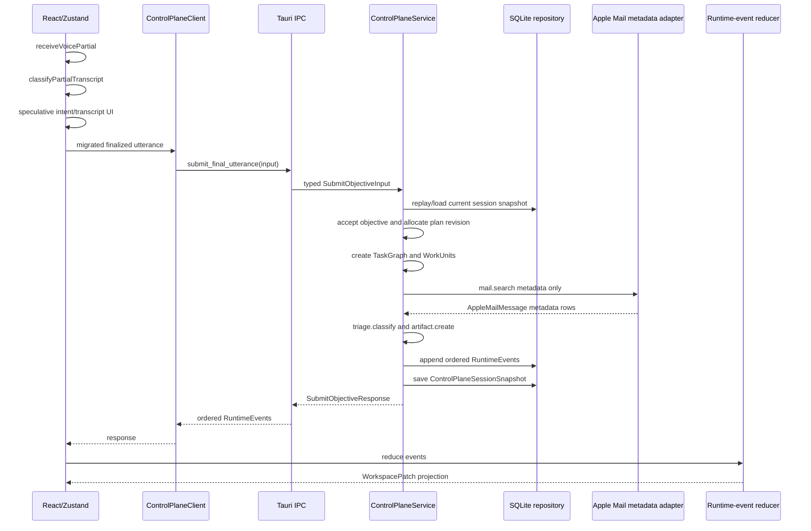

# Runtime Sequence

The live sequence keeps partial voice local and routes the migrated
inbox-triage slice through Rust in the Tauri app.

If the utterance is outside the migrated Rust slice, the client does not call
`submit_final_utterance`. The existing TypeScript compatibility path runs
instead. If a migrated call reaches Rust but is rejected or errors, the frontend
shows a command-error surface and does not run the legacy executor.

## Startup And Latency

The service opens a narrow SQLite repository under the local app support
directory and replays bounded session snapshots/events. It does not load atlas
content, call a model, or contact external services at startup.

Partial voice remains independent of that startup path, so first-intent UI stays
local and fast.

## Atlas Policy

Workflow-atlas material remains out of the runtime hot path. If added later, it
must be compiled into stable build-time manifests rather than injected wholesale
into prompts or loaded as raw runtime context.
