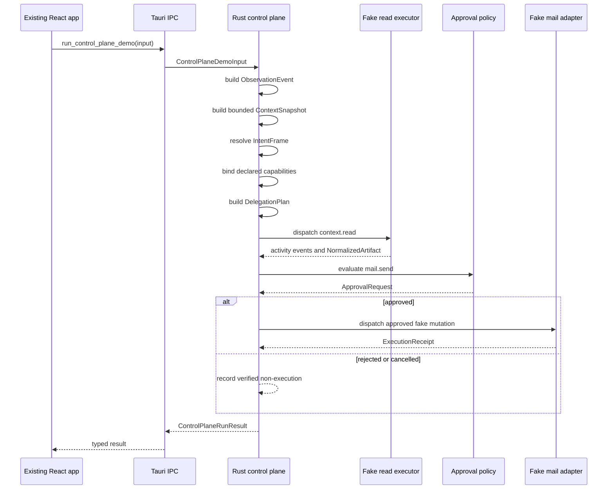

# Runtime Sequence

The implemented sequence is deterministic and local.

## Startup and Latency

The control-plane module does not load large files, call a model, or contact external services on startup. The demo command runs only when called. Its context, intent, routing, and policy decisions are local and deterministic.

## Atlas Policy

The workflow atlas is absent from this repository. Runtime schemas do not embed raw atlas content. If the atlas is added later, it should be compiled at build time into a compact manifest with stable IDs and hashes, then validated separately from startup.
