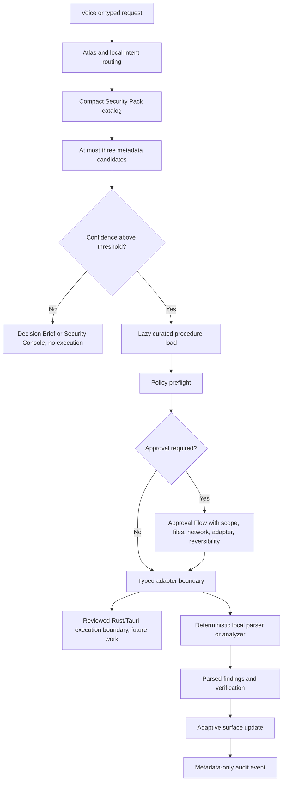

# Security Pack Architecture

## Purpose

The Security Pack adds curated FlowSurface product assets derived from exactly
eight upstream `Anthropic-Cybersecurity-Skills` directories. The raw upstream
files are vendored only as reference material under
`third_party/anthropic-cybersecurity-skills/`. They are not installed as Codex
Agent Skills and they are not parsed on the runtime hot path.

The Master Computer Workflow Atlas remains canonical. Security Pack manifests
only enrich Atlas Domain 53, Cybersecurity, Privacy & Trust, and Domain 55,
Artificial Intelligence, Machine Learning & Robotics.

## Data Flow

## Layers

- Atlas workflow layer: `src/intent/intent-classifier.ts` opens a
  security-oriented research surface for security phrasing. The detailed route
  selector lives in `src/security-pack/routing.ts`.
- Curated procedure layer: `src/security-pack/procedures.ts` contains
  project-owned procedures. Raw upstream Markdown is not treated as executable
  instruction.
- Typed action layer: `src/security-pack/types.ts` defines adapter and event
  contracts. Current implementation provides deterministic parsers and
  preflights, not native process execution.
- Deterministic policy layer: `src/security-pack/policy.ts` denies unknown
  capabilities, unknown adapters, path traversal, undeclared network
  destinations, destructive actions, disabled experimental adapters, signing,
  publication, key generation, and active probing.
- Runtime evidence layer: `SecurityAuditEvent` records metadata only. Sensitive
  content and raw tool output are excluded.
- Adaptive UI layer: existing surfaces render immediately. Full Security Pack
  UI components are not yet separate native components.

## Source Provenance

The source snapshot is pinned in
`third_party/anthropic-cybersecurity-skills/UPSTREAM.lock.json`.

- Repository: `https://github.com/mukul975/Anthropic-Cybersecurity-Skills`
- Release: `v1.3.0`
- Commit: `101ca0bd887a295e39cc20a100efa571937ca969`
- Review date: `2026-06-24`
- License: Apache-2.0
- Retained source aggregate SHA-256:
  `821980335c8c2c32892f9aba1631c0b0979111503b0d7d4fcd2fc9a8c2df365a`

Only `SKILL.md`, per-skill `LICENSE`, and directly relevant textual reference
or template Markdown files are retained. Upstream scripts are excluded and
executable bits are stripped.

## Skill Exposure

Production:

- `auditing-mcp-servers-for-tool-poisoning`
- `implementing-secret-scanning-with-gitleaks`
- `performing-threat-modeling-with-owasp-threat-dragon`

Internal:

- `detecting-ai-model-prompt-injection-attacks`
- `implementing-llm-guardrails-for-security`

Experimental, off by default:

- `analyzing-sbom-for-supply-chain-vulnerabilities`
- `implementing-sigstore-for-software-signing`
- `implementing-supply-chain-security-with-in-toto`

Sigstore and in-toto are verification-only. Signing, publication, key
generation, attestation generation, and active security probing remain disabled.

## Capability And Approval Matrix

| Workflow | Default | Risk | Approval | External tool |
| --- | --- | --- | --- | --- |
| MCP review | On | R1 | Once per selected scope for baseline writes | Optional scanner disabled |
| Secret scan | On | R2 | Per execution | Optional Gitleaks, version checked |
| Threat model | On | R0 | None | None required |
| Prompt-injection signals | On | R0 | None | None |
| LLM/tool guardrails | On | R0 | None | None |
| SBOM parse | Off | R1 | Once per selected file | Optional Syft/Grype disabled |
| Sigstore verify | Off | R2 | Per execution | Optional Cosign disabled |
| in-toto verify | Off | R2 | Per execution | Optional verifier disabled |

## External Tool Adapter Guide

No external binary is automatically installed or run. Current helpers only
preflight, build current command families, and parse fixture output.

Manual setup, when a future reviewed native adapter is added:

- Gitleaks: install a supported v8 release. The app uses `gitleaks git`,
  `gitleaks dir`, or `gitleaks stdin` with redaction. Deprecated `detect` and
  `protect` command families are not used.
- MCP scanner: the old `uvx mcp-scan@latest` flow is not reproduced. A future
  scanner must be reviewed as `snyk-agent-scan`, version-pinned, and disclosed
  before any network behavior.
- Syft and Grype: optional for experimental SBOM work only.
- Cosign: optional for verification only.
- in-toto verifier: optional for verification only.

## Privacy And Retention

- Raw scan output is ephemeral.
- Raw secrets are never persisted, shown, logged, or sent to telemetry.
- Secret findings retain only rule, severity, relative path, line range,
  redacted preview, fingerprint, commit reference, and remediation state.
- Audit records are local metadata only.
- Reports are saved only after an explicit user action.
- Model prompts must not include raw secrets or unredacted credentials.

## Threat Model

Minimum risks covered by the current design:

- Malicious upstream skill content: raw Markdown is reference-only.
- Prompt injection through security artifacts: detectors mark untrusted content
  as data and remain advisory.
- Poisoned MCP schemas: MCP metadata is canonicalized and hashable, with
  static checks and baseline drift findings.
- Executable substitution: unknown adapter IDs are denied.
- Path traversal and symlink-like escape: path traversal and outside-root paths
  are denied in policy preflight.
- Sensitive output leakage: secret parsing keeps redacted previews only.
- Excessive Tauri capabilities: no new Tauri permissions are added.
- Approval confusion: approval summaries include reads, writes, network, and
  adapter.
- Stale approval reuse: approval records are modeled but not yet persisted for
  Security Pack executions.
- Network exfiltration: undeclared network destinations are denied.
- Tool-version drift: Gitleaks version ranges are checked in preflight.
- Supply-chain compromise: source hashes and aggregate lock are verified.
- Audit-log sensitivity: audit contract excludes raw output and secrets.
- Feature-flag bypass: disabled experimental actions are filtered from routing
  and denied by policy.

## Feature Flags

Defined in `src/security-pack/feature-flags.ts`.

Default on:

- `security_pack_enabled`
- `security_mcp_review`
- `security_secret_scan`
- `security_threat_model`
- `security_prompt_injection_detection`
- `security_llm_guardrails`

Default off:

- `security_sbom_analysis`
- `security_sigstore_verification`
- `security_in_toto_verification`
- `security_external_mcp_scanner`
- `security_active_testing`
- `security_artifact_signing`
- `security_attestation_generation`

## Known Limitations

- There is no native Rust/Tauri Security Pack process runner yet.
- Security Pack surfaces reuse existing adaptive/research/approval surfaces
  rather than dedicated production UI components.
- Policy path checks are deterministic string checks in TypeScript. Native
  canonicalization and symlink resolution belong in the future Rust runner.
- SBOM, Sigstore, and in-toto workflows are local parser or evidence checks and
  remain off by default.
- No performance benchmark harness exists yet. Routing and policy are covered by
  deterministic unit tests.

## Upgrade Procedure

1. Run `npm run security:vendor` only when intentionally reviewing a new
   upstream snapshot.
2. Confirm the release tag, commit, and allowlist before accepting the result.
3. Review diffs in `third_party/anthropic-cybersecurity-skills/`.
4. Update curated procedures and tests separately from raw source.
5. Run `npm run security:verify-vendor`, `npm run typecheck`, and `npm test`.
6. Do not auto-merge or auto-activate upstream updates.
