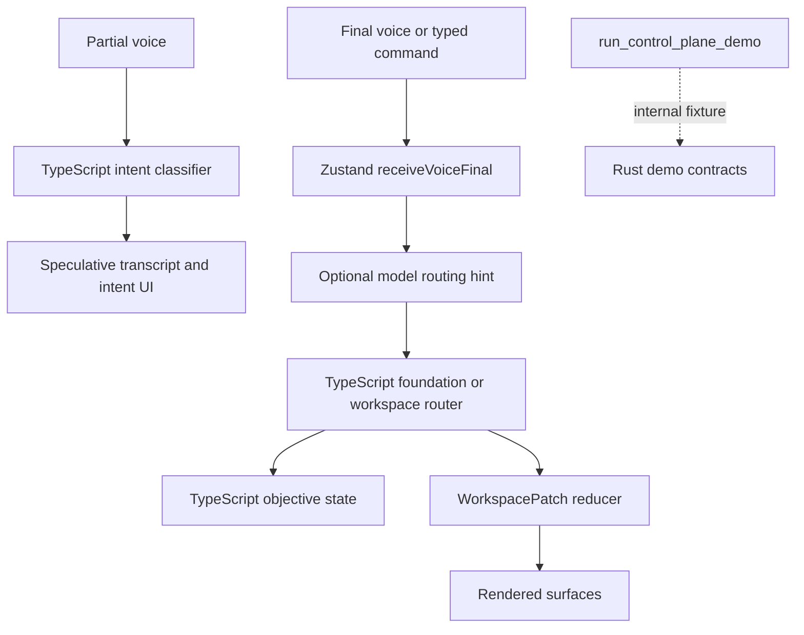
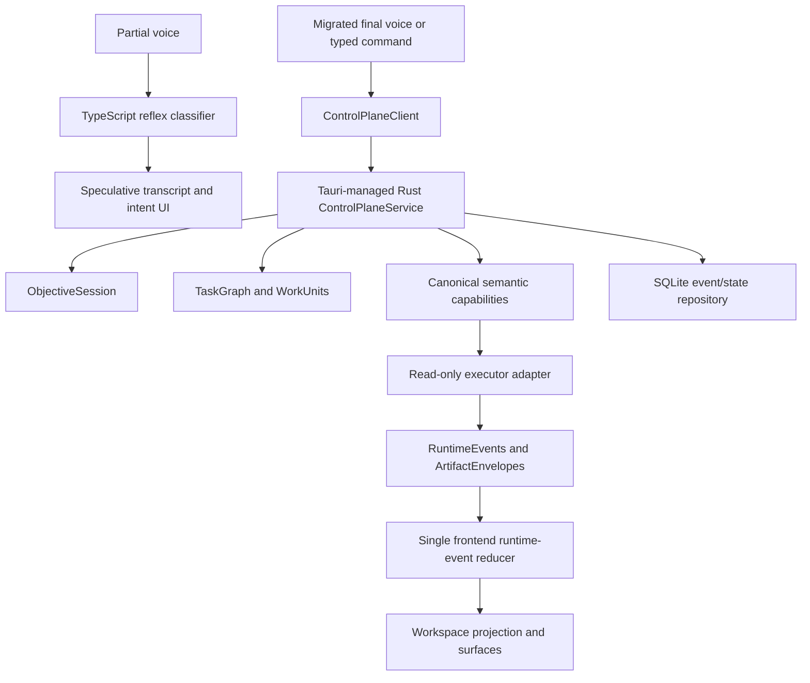

# Backend Control Plane Live Authority Plan

## Baseline Found

- Branch: `main`.
- Latest commit: `5893d08 Expand inbox triage intent matching`.
- Working tree before this plan: clean.
- The partial voice path is local and synchronous: Web Speech emits interim text
  into `receiveVoicePartial`, which runs `classifyPartialTranscript` and updates
  transcript, intent, and latency state.
- Finalized utterances still run primarily through TypeScript/Zustand:
  `receiveVoiceFinal` optionally asks model routing for a hint, routes through
  foundation commands or workspace voice actions, mutates objective state, and
  applies `WorkspacePatch[]` directly.
- Rust previously exposed `run_control_plane_demo`, with useful contracts and
  tests, but the live frontend does not use it as the authority.
- Inbox triage is currently a TypeScript foundation command that reads Apple Mail
  metadata only and creates an in-app document artifact. It does not read full
  bodies, write to disk, or mutate a mailbox.

## Current State



## Target State



## Migration Seams

- Preserve `receiveVoicePartial` as the fast speculative path.
- Add a typed `ControlPlaneClient` for finalized utterances.
- Register a Tauri-managed `ControlPlaneService` instead of treating
  `run_control_plane_demo` as production authority.
- Add a single frontend runtime-event reducer that projects authoritative Rust
  events into existing workspace patches.
- Keep browser-only development testable with a mock transport that produces the
  same runtime-event protocol.
- Migrate the inbox-triage vertical slice first:
  `submit_final_utterance` -> Rust task graph -> `mail.search` metadata
  work unit -> triage/classification work unit -> `artifact.create` work unit ->
  runtime events -> current document surface.
- Keep existing TypeScript routers as compatibility fallback for browser mode
  and non-migrated routes, not as the Tauri finalized authority for the migrated
  path.

## Milestones

1. Extend Rust contracts with task graph, work unit, runtime event, artifact
   envelope, semantic capabilities, plan revisions, monotonic event sequence,
   cancellation, approvals, safe diagnostics, and protocol versioning.
2. Add `ControlPlaneService`, a scheduler for the first vertical slice,
   canonical capability descriptors, cancellation and approval commands, session
   snapshots, and SQLite-backed persistence.
3. Register live Tauri commands:
   `submit_final_utterance`, `cancel_operation`, `approve_operation`,
   `reject_operation`, `get_session_snapshot`, and `list_pending_approvals`.
4. Add the frontend client, mock transport, runtime-event reducer, and store
   integration for migrated finalized Tauri utterances.
5. Route inbox triage through the Rust-owned kernel while preserving existing
   metadata-only, read-only user-visible behavior.
6. Add tests for Rust lifecycle, persistence/replay, approval revision binding,
   duplicate/stale event handling, frontend projection, and browser mock.
7. Update architecture docs, run verification, rebuild the local macOS app
   bundle, replace the installed app, then commit and push because this task
   explicitly requested repo and app updates.

## Compatibility Strategy

- Existing workspace surface types and props remain the renderer boundary.
- Existing foundation command runner remains available as an executor/fallback
  for non-migrated routes and browser tests.
- The migrated inbox triage route uses current document-surface semantics,
  including `writesToDisk=false`, `writesToMailbox=false`, and
  `fullBodiesRead=false`.
- Rust is the source of truth for migrated semantic capability IDs and risk
  classes. Frontend definitions stay as compatibility projections with drift
  tests.

## Risks And Mitigations

- Split-brain state: route Tauri finalized inbox-triage utterances through
  `ControlPlaneService`; keep TypeScript fallback explicit and test-gated.
- Capability drift: expose canonical migrated capabilities from Rust and test
  frontend semantic IDs against them.
- External mutation: first slice is read-only metadata and in-app artifacts only;
  mutating commands remain approval-gated and out of the migrated inbox triage
  executor.
- Persistence leakage: persist bounded derived metadata, event payloads, and
  artifact summaries, not raw full message bodies or secrets.
- Event replay bugs: use global monotonic sequence numbers, event IDs, and
  idempotent frontend reducer logic.
- UI overwrite: project only controlled workspace patches and preserve existing
  local interaction state outside the backend projection path.

## Validation Commands

```bash
npm run typecheck
npm test
npm run build
npm run eval:golden
cargo check --manifest-path src-tauri/Cargo.toml
cargo test --manifest-path src-tauri/Cargo.toml
```

For the requested local app update:

```bash
npm run tauri:app
```

Then replace `/Applications/Adaptive Surface.app` from the generated bundle and
verify executable hashes match.

## Rollback Strategy

- Frontend rollback seam: route migrated inbox-triage utterances back to the
  legacy TypeScript path by disabling the `submit_final_utterance` client call.
- Backend rollback seam: leave `run_control_plane_demo` intact while removing
  the live command registrations and service state.
- Persistence rollback: delete the control-plane SQLite database from the app
  data directory if a local replay issue occurs. This does not delete Mail,
  Calendar, Notes, Reminders, or filesystem data.
- Installed app rollback: restore the timestamped backup of
  `/Applications/Adaptive Surface.app` created before replacement.

## Explicit Non-Goals

- No generalized multi-agent runtime.
- No LangGraph, Hermes, OpenClaw, or A2A integration.
- No workflow-atlas hot-path ingestion.
- No new visual redesign.
- No raw computer-control automation.
- No expanded OS permissions or Tauri capabilities.
- No sending, archiving, deleting, moving, marking, or mutating mail.
- No DMG generation or release automation unless separately requested.
